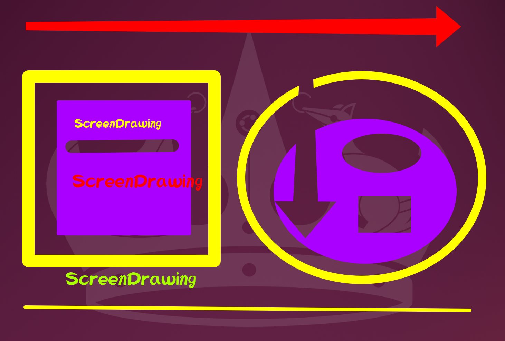

# ScreenDrawing

Lightweight screen drawing tool for Linux (Wayland optimized).  
Designed for real-time on-screen annotation with pen, shapes, text, highlighter, eraser, and undo.

---

## ✨ Features

### Drawing Tools
- **Pen** — freehand drawing
- **Rectangle** — drag to draw a rectangle
- **Ellipse** — drag to draw an ellipse
- **Line** — drag to draw a straight line
- **Arrow** — drag to draw an arrow
- **Text** — click to place inline text  
  - Enter → Line break  
  - Ctrl+Enter → Confirm text (draw on canvas)  
  - Escape → Cancel


### Options
- **Fill** — fill rectangle/ellipse with color
- **Highlight** — semi-transparent overlay (pen, line, rect, ellipse)
- **Eraser** — remove strokes by brush or shape area

### Convenience
- **Color picker** — choose any pen color
- **Stroke width** — adjustable thickness (shared with eraser size)
- **Font selector** — choose font family and size
- **Quick size buttons** — 10 / 16 / 24 / 36 (applies to both stroke width and font size)
- **Undo** — up to 50 steps
- **Clear All** — wipe the entire canvas
- **Save** — export drawing layer as transparent PNG

### Settings Auto-save
Tool selection, color, stroke width, fill, highlight mode, and font are automatically saved on exit and restored on next launch.  
Settings are stored at: `~/.local/share/screendrawing/settings.json`

### Keyboard Shortcuts
- **Hold Ctrl** — temporary eraser (releases back to previous tool)
- **Hold Shift** — temporary straight line (releases back to previous tool)

### Other
- Auto language detection (Korean / English based on system locale)
- Wayland compatible (GNOME tested)
- Lightweight — PyQt5 only, no extra dependencies

---

## 🖥️ Environment

Tested on:

- Ubuntu 24.04
- GNOME Wayland Session
- Python 3.x + PyQt5

---

## 📦 Requirements

```bash
pip install PyQt5
```

---

## 📦 Installation via pip (Recommended)

```bash
pip install screendrawing --break-system-packages
```

Then run from anywhere:

```bash
screendrawing
```

---

## 📥 Manual Installation (without pip)

### 1. Download

Download `screendrawing.py` from this repository.

### 2. Make executable

```bash
chmod +x screendrawing.py
```

### 3. Install to user PATH


```bash
mkdir -p ~/.local/bin
mv screendrawing.py ~/.local/bin/screendrawing
chmod +x ~/.local/bin/screendrawing
```

Make sure `~/.local/bin` is in your PATH. Add to `~/.bashrc` or `~/.zshrc` if needed:

```bash
export PATH="$HOME/.local/bin:$PATH"
```

Now you can run it from anywhere:

```bash
screendrawing
```

---

## ⚠️ Wayland (GNOME) Notes

ScreenDrawing is primarily developed and tested on GNOME Wayland.

If the toolbar does not appear, try running with the platform flag:

```bash
QT_QPA_PLATFORM=wayland screendrawing
```

---

## 💾 Save Behavior

The **Save** button exports the drawing layer only as a transparent PNG (`~/drawing_YYYYMMDD_HHMMSS.png`).

This is intentional and useful for:

- Overlay editing in image editors
- Presentation slides
- Video annotation
- Tutorial / lecture materials
- Image compositing

To capture the full screen including the background and your drawings, use an external screenshot tool **while ScreenDrawing is running**:

- **GNOME Screenshot** (`gnome-screenshot`)
- **Spectacle** (KDE)
- **Flameshot**

---

## 🚀 Desktop Launcher

To add ScreenDrawing to the application menu, create a `.desktop` file:

```bash
nano ~/.local/share/applications/screendrawing.desktop
```

Paste the following:

```ini
[Desktop Entry]
Encoding=UTF-8
Exec=screendrawing
Icon=applications-graphics
Type=Application
Terminal=false
Name=ScreenDrawing
GenericName=Screen Drawing Tool
Comment=Lightweight screen drawing overlay
StartupNotify=false
Categories=Utility;
```

Then refresh the application database:

```bash
update-desktop-database ~/.local/share/applications
```

ScreenDrawing will now appear in your application menu.

---

## 🎮 Controls

### Keyboard Shortcuts

| Key            | Function                        |
|----------------|---------------------------------|
| `Ctrl + Z`     | Undo                            |
| `Ctrl + S`     | Save (transparent PNG)          |
| `Ctrl + Q`     | Exit                            |
| `C`            | Clear canvas                    |
| `ESC`          | Exit                            |
| Hold `Ctrl`    | Temporary eraser                |
| Hold `Shift`   | Temporary straight line         |
| `Ctrl + Enter` | Confirm text (draw on canvas)   |

### Toolbar Buttons

| Button        | Function                                      |
|---------------|-----------------------------------------------|
| Pen           | Freehand drawing                              |
| Rect          | Rectangle                                     |
| Ellipse       | Ellipse / circle                              |
| Line          | Straight line                                 |
| Arrow         | Draw an arrow                                 |
| Text          | Inline text input (on canvas)                 |
|               | • Enter → Line break                          |
|               | • Ctrl+Enter → Confirm text (draw on canvas)  |
|               | • Escape → Cancel                             |
| Color         | Open color picker                             |
| Width         | Stroke width (also controls eraser size)      |
| Font          | Open font selector                            |
| Size          | Font size                                     |
| 10/16/24/36   | Quick size preset (stroke width + font size)  |
| Fill          | Toggle fill for rectangle / ellipse           |
| Highlight     | Toggle semi-transparent highlight mode        |
| Eraser        | Toggle eraser mode                            |
| Undo          | Undo last action (up to 50 steps)             |
| Save          | Save drawing as transparent PNG               |
| Clear All     | Clear entire canvas                           |
| Exit          | Close the application                         |


---

## 📌 Notes

- Runs as a fullscreen transparent overlay
- Eraser size is shared with the stroke width setting
- Highlight mode works on pen (freehand), line, rectangle, and ellipse
- Holding `Ctrl` or `Shift` temporarily switches tools and restores them on release
- All drawing is non-destructive to the desktop — only the overlay canvas is affected
- Settings (tool, color, width, font, fill, highlight) are auto-saved on exit to `~/.local/share/screendrawing/settings.json`

---

## 👤 Author

Jeong SeongYong  
Email: iyagicom@gmail.com  
GitHub: [iyagicom](https://github.com/iyagicom)

---

## 📜 License

This project is licensed under the **GPL-2.0-or-later**.  
이 프로젝트는 GPL-2.0-or-later 라이선스 하에 배포됩니다.

You are free to use, modify, and redistribute under GPL terms.  
See [GNU GPL v2](https://www.gnu.org/licenses/old-licenses/gpl-2.0.html) for details.
